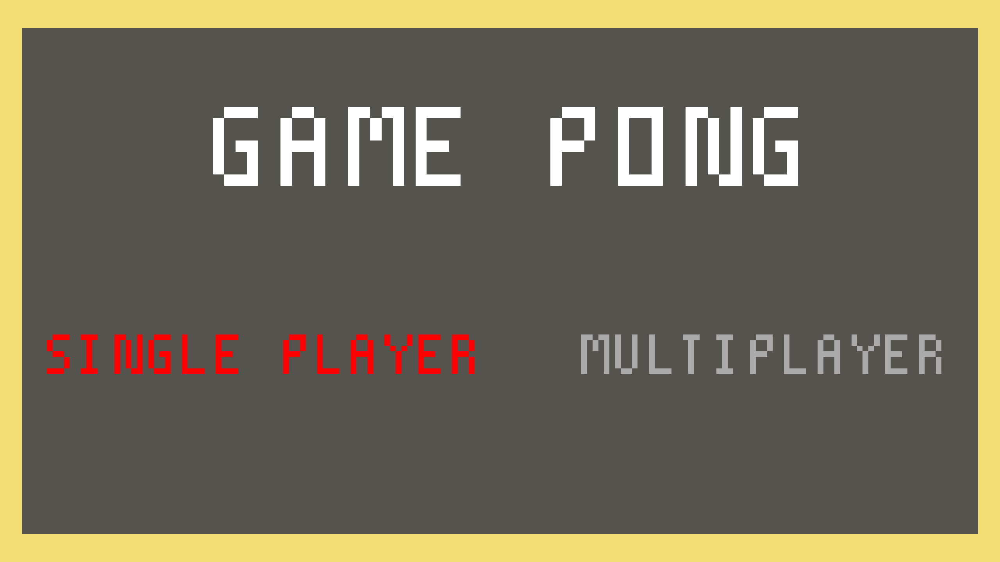
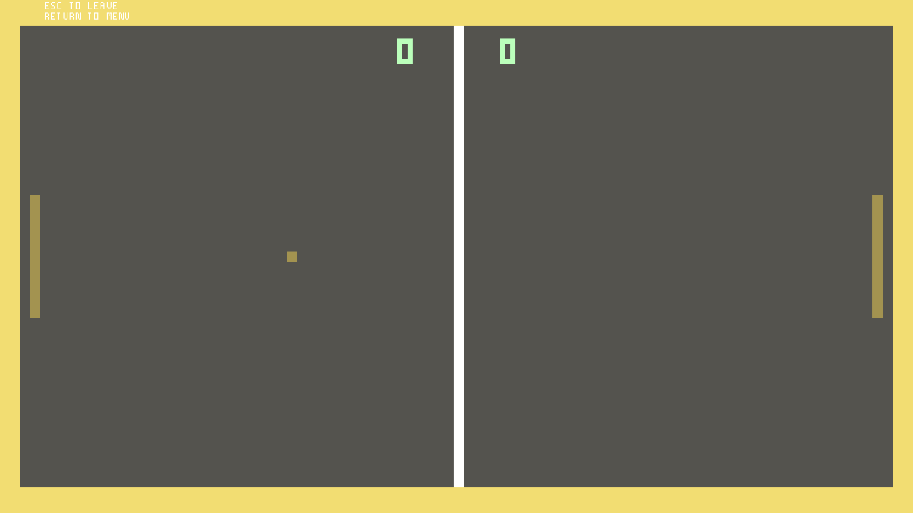

# Pong

This game was build using the Win32 library.
It's not completed yet but you can choose two modes. 
In the first mode you are going to play against the computer (I used simple AI) and the second mode is called multiple-player so you could compete against your friend for example.
In the future, I plan to expand this game, for instance, expand the menu where you will be able to change the theme and choose the level of computer mode.

